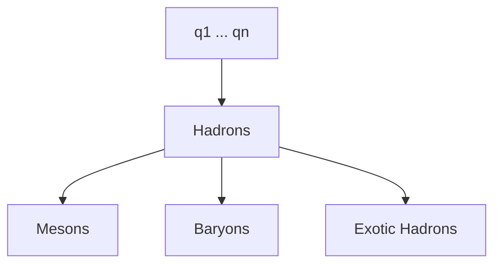

At the beginning, I want to clarify that I'm not a physicist, but I'm interested in physics and I'm trying to understand it better. This post is collection of my old notes and even though I read them again and tried to correct them, there might be some mistakes. If you find any, please let me know.

_**Standard Model of Particle Physics**: Overview of the fundamental particles and forces in the Standard Model._

## Fundamental Particles

The Standard Model categorizes all known fundamental particles into three main groups: quarks, leptons, and gauge bosons. These particles interact through the fundamental forces of nature, which are mediated by gauge bosons.

Before we dive into the details, let's define some key terms.

### Key Quantum Numbers and Properties

Quantum numbers are properties that characterize particles and determine their behavior in quantum mechanics. For our discussion, we will focus specifically on those that are most relevant to the Standard Model.

#### Mass

Although fundamental particles are incredibly small, they can possess measurable masses, notably the $W$ and $Z$ bosons. This mass, however, is not the same as everyday mass; it is a measure of energy.

In particle physics, mass is frequently measured in electronvolts (eV), where $1\text{ eV}$ represents the energy gained or lost by an electron when accelerated through an electric potential difference of $1\text{ V}$. This unit scales in the same way as other SI units, allowing for conversion to larger units such as giga-electronvolts (GeV) by multiplying by $10^9$.

The relationship between energy and mass is described by Einstein's equation $E=mc^2$. Consequently, $1\text{ eV}$ of energy corresponds to a mass of approximately $1.783 \times 10^{-36}$kg.

In particle physics, the total energy of a particle is often described by:

$$
\begin{equation}
E^2 = (pc)^2 + (m_0 c^2)^2
\label{eq:energy_momentum_mass}
\end{equation}
$$

where $p$ is the momentum of the particle, $m_0$ is its rest mass, and $c$ is the speed of light.

#### Charge

Charge is a fundamental property of particles that causes them to experience electromagnetic forces. Particles can have positive, negative, or neutral charges, with the electron having a charge of $-e$ and the proton having a charge of $+e$.

The unit of charge is Columb (C) but for fundamental particles is usually used elementary charge (e).

$$
e\approx1.602\times10^{-19}C
$$

#### Spin

Fundamental quantum property of particles representing their intrinsic angular momentum, which affects their behavior in magnetic fields.

Particles can have integer or half-integer spin values, with fermions (e.g., quarks, leptons) having half-integer spins and bosons (e.g., gauge bosons) having integer spins.

As spins are quite complex topic and deal with quantum mechanics, I won't go into details here. But you can expect a separate post just about spins in the near future. All you need to know for now is that the spin is not the same as the classical angular momentum.

### Fermions

Fermions are particles that obey Fermi-Dirac statistics and follow the Pauli exclusion principle, which states that no two identical fermions can occupy the same quantum state simultaneously. To explain this a bit more, for example, electrons are fermions, and they can't occupy the same quantum state in an atom.

#### Quarks

Quarks are the building blocks of hadrons (protons, neutrons etc.) and are never found in isolation due to confinement, a phenomenon where quarks are bound together in color-neutral combinations. Quarks come in six flavors:

1. **Up ($u$)**
2. **Down ($d$)**
3. **Charm ($c$)**
4. **Strange ($s$)**
5. **Top ($t$)**
6. **Bottom ($b$)**

All quarks have fractional electric charges, with the up, charm and top quarks having a charge of $+\frac{2}{3}e$, and the down, strange and bottom quarks having a charge of $-\frac{1}{3}e$.

##### Quark Color Charge

Quarks also carry a property called color charge, which is associated with the strong nuclear force. Quarks come in three "colors": red, green, and blue and their anti-colors: anti-red, anti-green, and anti-blue. The term "color" is a metaphorical description and does not refer to the colors we see in everyday life. Quarks must combine in color-neutral combinations to form hadrons.

If the color explanation is confusing, you can instead imagine the colors as a vector (two dimensional one is enough). So let's say that red is $(1,0)$, green is $(0,1)$ and blue is $(-1,-1)$. Then the color-neutral combination would be:

$$
\begin{equation}
(1,0)+(0,1)+(-1,-1)=(0,0)
\label{eq:color_neutral_combination}
\end{equation}
$$

Thus the color-neutral combination is $(0,0)$ which is the same as no color. For anti-colors, you just need to change the sign of the vector. So anti-red would be $(-1,0)$, anti-green $(0,-1)$ and anti-blue $(1,1)$. As stated before, the resulting particle must have a color-neutral combination, so it can be a quark-antiquark pair, three quarks or more complex combinations.

##### Quark Confinement

Quarks are never found in isolation due to a phenomenon called quark confinement. This means that quarks are always bound together in groups of two or more, forming color-neutral particles called hadrons.

- **Mesons**: Consist of a quark and an antiquark. ($q\bar{q}$)
- **Baryons**: Consist of three quarks. ($qqq$)
- **Exotic Hadrons**: Include particles composed of more than three quarks, such as tetraquarks ($qq\bar{q}\bar{q}$) and pentaquarks ($qqqq\bar{q}$).

This is a simplified representation of the relationship between quarks and hadrons. Quarks combine to form hadrons, which include mesons and baryons. Exotic hadrons are more complex combinations of quarks.

#### Leptons

Leptons are a group of fundamental particles that do not experience the strong nuclear force. There are six types of leptons, each with a unique flavor:

1. **Electron ($e$)**
2. **Muon ($\mu$)**
3. **Tau ($\tau$)**
4. **Electron neutrino ($\nu_e$)**
5. **Muon neutrino ($\nu_\mu$)**
6. **Tau neutrino ($\nu_\tau$)**

Leptons are divided into two categories:

- **Charged Leptons**: Include the electron, muon, and tau, which have electric charge of $-1e$.
- **Neutrinos**: Include the electron neutrino, muon neutrino, and tau neutrino, which are neutral and weakly interacting.

##### Neutrinos

Neutrinos are neutral, weakly interacting particles that come in three flavors: electron neutrino, muon neutrino, and tau neutrino. They have very small masses and are produced in various nuclear reactions and particle decays.

Neutrinos are challenging to detect due to their weak interactions with matter, but they play a crucial role in processes like beta decay and neutrino oscillations.

##### Neutrino Oscillation

Neutrino oscillation is a phenomenon where neutrinos change flavors as they travel through space. This effect arises from the mixing of neutrino mass eigenstates, leading to oscillation between different flavor states.

Neutrino oscillation occurs because the flavor eigenstates (which are the states detected in experiments) are mixtures of the mass eigenstates (which are the states that propagate through space).

- **Flavor Eigenstates** ($\nu_e$, $\nu_\mu$, $\nu_\tau$​): These are the states in which neutrinos are produced and detected.
- **Mass Eigenstates** ($\nu_1$, $\nu_2$, $\nu_3$​): These are the states with definite masses that travel through space.

The probability of a neutrino of flavor $\nu_\alpha$​ transforming into a neutrino of flavor $\nu_\beta$​ over a distance $L$ is given by the oscillation probability formula:

$$
\begin{equation}
P(\nu_\alpha\to\nu_\beta)=\sin^2(2\theta)\sin^2(\frac{\Delta m^2L}{4E})
\label{eq:neutrino_oscillations}
\end{equation}
$$

- $\theta$ - mixing angle between the flavor and mass eigenstates.
- $\Delta m^2$ - difference in the squared masses of the mass eigenstates.
- $L$ - distance traveled by the neutrino.
- $E$ - energy of the neutrino.

For long time, neutrinos were thought to be massless, but the discovery of neutrino oscillations provided evidence that neutrinos must have non-zero masses.

The key to understanding why neutrinos must have mass lies in the $\Delta m^2$ term. If neutrinos were massless, $\Delta m^2$ would be zero. This would make the argument of the sine function:

$$
\begin{equation}
\sin^2(\frac{\Delta m^2L}{4E})=\sin^2(0)=0
\label{eq:neutrino_oscillations_zero_mass}
\end{equation}
$$

Thus, $\sin^2\left(\frac{\Delta m^2 L}{4E}\right)$ would always be zero, implying that the probability of detecting a neutrino of a different flavor would be zero as well. This means no oscillations would occur.

However, since neutrinos do oscillate between flavors, the non-zero oscillation probability indicates that $\Delta m^2$ is not zero. This non-zero mass squared difference $\Delta m^2$ implies that the neutrino mass eigenstates are not degenerate; thus, neutrinos must have mass.

###### Key Points

- **Mixing Angle ($\theta$)**: Describes how much the flavor eigenstates mix with the mass eigenstates.
- **Mass Squared Difference ($\Delta m^2$)**: The difference in squared masses between the mass eigenstates affects the oscillation frequency.
- **Energy and Distance**: The oscillation pattern depends on the energy of the neutrino and the distance it travels.

The term $\sin^2(2\theta)$ reflects the strength of the mixing between the flavor and mass eigenstates, while $\sin^2(\frac{\Delta m^2L}{4E})$ describes the oscillation pattern, which varies with distance and energy. This formula captures the essential features of neutrino oscillations, demonstrating how neutrinos can change flavors as they travel.

### Gauge Bosons

Gauge bosons are the force carriers that mediate the fundamental forces of nature. Unlike fermions, gauge bosons are bosons, which follow Bose-Einstein statistics and do not obey the Pauli exclusion principle. They are responsible for transmitting forces between particles.

1. **Photon ($\gamma$)** - Mediates the electromagnetic force.
2. **$W$ and $Z$ bosons ($W^+$, $W^-$, $Z^0$)** - Mediate the weak nuclear force.

   - Both $W$ and $Z$ bosons are massive

   $$
   m_W\approx80GeV/c^2
   $$

   $$
   m_Z\approx91GeV/c^2
   $$

3. **Gluons ($g$)** - Mediate the strong nuclear force.
4. **Higgs Boson ($H$)** - Excitation of Higgs field.

**Higgs boson** is often included in discussions about the Standard Model because it is responsible for giving mass to other particles through the Higgs mechanism.

## Fundamental Forces

The Standard Model describes three of the four fundamental forces:

1. **Electromagnetic Force** - Mediated by photons, it affects particles with electric charge.
2. **Weak Nuclear Force** - Mediated by $W$ and $Z$ bosons, it is responsible for processes like beta decay.
3. **Strong Nuclear Force** - Mediated by gluons, it binds quarks together to form protons, neutrons and other hadrons and holds the atomic nucleus together.

## Interaction Mechanisms

### Electromagnetic Interaction

This is described by Quantum Electrodynamics (QED), where charged particles interact by exchanging photons. The electromagnetic force is long-ranged and can be attractive or repulsive.

#### Quantum Electrodynamics (QED) Lagrangian

The QED Lagrangian describes the interactions of electrons, positrons, and photons in the electromagnetic force. It can be expressed as:

$$
\begin{equation}
\mathcal{L}_{QED} = -\frac{1}{4} F_{\mu\nu} F^{\mu\nu} + \bar{\psi} (i \gamma^\mu D_\mu - m) \psi
\label{eq:qed_lagrangian}
\end{equation}
$$

1. **Electromagnetic Field Strength Tensor** ($F_{\mu\nu}$):

   $$
   \begin{equation}
   F_{\mu\nu} = \partial_\mu A_\nu - \partial_\nu A_\mu
   \label{eq:em_field_strength_tensor}
   \end{equation}
   $$

   - **Explanation**: This term describes the field strength of the electromagnetic field. It involves the derivative of the electromagnetic potential $A_\mu$. The field strength tensor is antisymmetric, reflecting the nature of the electromagnetic force.

2. **Electron Kinetic Term** $(\bar{\psi}(i\gamma^\mu D_\mu-m)\psi)$:

   - **$\bar{\psi}$** - Dirac adjoint of the electron field $\psi$.
   - **$i \gamma^\mu D_\mu$** - Represents the kinetic term of the electrons, where $\gamma^\mu$ are the gamma matrices associated with the Dirac equation and $D_\mu$ is the covariant derivative.
   - **Covariant Derivative** ($D_\mu$):

     $$
     \begin{equation}
     D_\mu = \partial_\mu - i e A_\mu
     \label{eq:covariant_derivative_for_electrons}
     \end{equation}
     $$

   - **Explanation**: This accounts for the interaction of electrons with the electromagnetic field. $e$ is the electric charge, and $A_\mu$ is the electromagnetic potential.

3. **Electron Mass Term** $(-m)$:
   - **Explanation**: Represents the mass of the electron, contributing to the electron's energy in the Lagrangian. $(m)$ is the mass of the electron.

##### Key Points

- **Photon Field Strength Tensor**: The term $-\frac{1}{4}F_{\mu\nu}F^{\mu\nu}$ describes the field strength of the electromagnetic field, involving the derivative of the electromagnetic potential $(A_\mu)$.
- **Electron-Photon Interactions**: The covariant derivative $(D_\mu)$ in the electron term shows how electrons interact with the electromagnetic field. This term ensures that the theory respects gauge invariance under U(1) transformations.
- **Mass of Electrons**: The electron mass term shows how electrons acquire mass, contributing to the mass of atoms and molecules. In QED, the mass of the electron is a fundamental parameter of the theory.

### Weak Interaction

Described by the Electroweak Theory, it unifies the electromagnetic force and the weak force at high energy levels. The weak force is responsible for changing one type of quark into another, leading to nuclear reactions.

#### Electroweak Theory Lagrangian

The Electroweak Lagrangian describes the interactions of leptons, quarks, and gauge bosons in the electroweak force. It can be expressed as:

$$
\begin{equation}
\mathcal{L}_{EW} = -\frac{1}{4} W^a_{\mu\nu} W^{a\mu\nu} - \frac{1}{4} B_{\mu\nu} B^{\mu\nu} + \bar{\psi} (i \gamma^\mu D_\mu - m) \psi
\label{eq:electroweak_lagrangian}
\end{equation}
$$

1. **$W$ and $B$ Field Strength Tensors** ($W^a_{\mu\nu}$, $B_{\mu\nu}$):

   - **$W$ Field Strength Tensor** ($W^a_{\mu\nu}$):

     $$
     \begin{equation}
     W^a_{\mu\nu} = \partial_\mu W^a_\nu - \partial_\nu W^a_\mu + g \epsilon^{abc} W^b_\mu W^c_\nu
     \label{eq:w_field_strength_tensor}
     \end{equation}
     $$

   - **$B$ Field Strength Tensor** ($B_{\mu\nu}$):

     $$
     \begin{equation}
     B_{\mu\nu} = \partial_\mu B_\nu - \partial_\nu B_\mu
     \label{eq:b_field_strength_tensor}
     \end{equation}
     $$

   - **Explanation**: These terms describe the field strengths of the $W$ and $B$ fields, which are associated with the weak and electromagnetic forces, respectively. The $W$ field strength tensor involves the non-Abelian field strength term, reflecting the non-Abelian nature of the weak force.

2. **Lepton/Quark Kinetic Term** $(\bar{\psi}(i\gamma^\mu D_\mu-m)\psi)$:

   - **$\bar{\psi}$** - Dirac adjoint of the lepton/quark field $\psi$.
   - **$i \gamma^\mu D_\mu$** - Represents the kinetic term of the leptons/quarks, where $\gamma^\mu$ are the gamma matrices associated with the Dirac equation and $D_\mu$ is the covariant derivative.
   - **Covariant Derivative** ($D_\mu$):

     $$
     \begin{equation}
     D_\mu = \partial_\mu - i g' Y B_\mu - i g \frac{\tau^a}{2} W^a_\mu
     \label{eq:covariant_derivative_for_leptons_quarks}
     \end{equation}
     $$

   - **Explanation**: This accounts for the interaction of leptons/quarks with the $W$ and $B$ fields. $g'$ and $g$ are the coupling constants for the $U(1)$ and $SU(2)$ gauge groups, respectively. $Y$ is the weak hypercharge, and $\frac{\tau^a}{2}$ are the generators of the $SU(2)$ group.

3. **Lepton/Quark Mass Term** $(-m)$:
   - **Explanation**: Represents the mass of the leptons/quarks, contributing to the mass of particles. $(m)$ is the mass of the lepton/quark.

##### Key Points

- **$W$ and $B$ Field Strength Tensors**: The $W$ and $B$ field strength tensors describe the field strengths of the weak and electromagnetic fields, respectively. The $W$ field strength tensor involves the non-Abelian field strength term, reflecting the non-Abelian nature of the weak force.
- **Lepton/Quark Interactions**: The covariant derivative $(D_\mu)$ in the lepton/quark term shows how leptons/quarks interact with the $W$ and $B$ fields. This term ensures that the theory respects gauge invariance under $U(1)$ and $SU(2)$ transformations.
- **Mass of Leptons/Quarks**: The lepton/quark mass term shows how leptons/quarks acquire mass, contributing to the mass of particles. In the Electroweak Theory, the masses of leptons and quarks are fundamental parameters of the theory.

### Strong Interaction

Described by Quantum Chromodynamics (QCD), it involves quarks exchanging gluons. Quarks come in three "colors" (red, green, blue), and gluons carry a color charge that changes as they interact, ensuring quarks remain confined within protons and neutrons.

#### Quantum Chromodynamics (QCD) Lagrangian

The QCD Lagrangian describes the interactions of quarks and gluons, the fundamental constituents of the strong force. The Lagrangian can be expressed as:

$$
\begin{equation}
\mathcal{L}_{QCD} = -\frac{1}{4} G^a_{\mu\nu} G^{a\mu\nu} + \sum_q \bar{q} (i \gamma^\mu D_\mu - m_q) q
\label{eq:qcd_lagrangian}
\end{equation}
$$

1. **Gluon Field Strength Tensor** ($G^a_{\mu\nu}$):

   $$
   \begin{equation}
   G^a_{\mu\nu} = \partial_\mu G^a_\nu - \partial_\nu G^a_\mu + g_s f^{abc} G^b_\mu G^c_\nu
   \label{eq:gluon_field_strength_tensor}
   \end{equation}
   $$

   - **Explanation**: This term describes the field strength of gluons. It involves the derivative of the gluon fields $(\partial_\mu G^a_\nu$ and $\partial_\nu G^a_\mu)$ and the non-Abelian field strength term involving the structure constants $f^{abc}$, which accounts for the interaction between gluons themselves.

2. **Quark Kinetic Term** $(\bar{q}(i\gamma^\mu D_\mu-m_q)q)$:

   - **$\bar{q}$** - Dirac adjoint of the quark field $q$.
   - **$i \gamma^\mu D_\mu$** - Represents the kinetic term of the quarks, where $\gamma^\mu$ are the gamma matrices associated with the Dirac equation and $D_\mu$ is the covariant derivative.
   - **Covariant Derivative** ($D_\mu$):

     $$
     \begin{equation}
     D_\mu = \partial_\mu - i g_s \frac{\lambda^a}{2} G^a_\mu
     \label{eq:quark_covariant_derivative_qcd}
     \end{equation}
     $$

   - **Explanation**: This accounts for the interaction of quarks with gluons. $g_s$ is the strong coupling constant, and $\frac{\lambda^a}{2}$ are the generators of the SU(3) color gauge group. $G^a_\mu$ are the gluon fields.

3. **Quark Mass Term** $(-m_q)$:
   - **Explanation**: Represents the mass of the quarks, which interacts with the quark fields. $(m_q)$ is the mass of the quark.

##### Key Points

- **Color Charge**: Quarks come in three "colors" (red, green, blue) and interact via the exchange of gluons, which also carry color charge. This self-interaction among gluons is unique to non-Abelian gauge theories like QCD.
- **Gauge Group**: The symmetry group for QCD is SU(3), reflecting the fact that there are three types of color charges in strong interactions. The structure constants $(f^{abc})$ encode the non-Abelian nature of the theory.
- **Confinement**: QCD explains why quarks are never found in isolation but only in color-neutral combinations (hadrons). The interactions are so strong that quarks are confined within hadrons.

## Higgs Mechanism

The Higgs boson is an excitation of the Higgs field, discovered in 2012 at CERN. The Higgs mechanism explains how particles acquire mass through their interactions with this field. The Higgs field permeates all of space and gives mass to fundamental particles. The Higgs mechanism is crucial for understanding the origin of mass in the Standard Model.

### Higgs Field

The Higgs field is a scalar field that has a non-zero value in the vacuum. It interacts with other particles, giving them mass. The Higgs field is described by a potential that has a "Mexican hat" shape, with a minimum at a non-zero value. This non-zero vacuum expectation value (VEV) of the Higgs field breaks the electroweak symmetry and gives mass to the $W$ and $Z$ bosons.

## Limitations

While the Standard Model is incredibly successful, it has limitations:

- **Gravity**: The Standard Model does not include gravity, which is described by General Relativity and is not quantized.
- **Dark Matter and Dark Energy**: These are components of the universe that do not interact via the Standard Model forces.
- **Neutrino Masses**: Neutrino masses were a later addition to the Standard Model after the discovery of neutrino oscillations.
- **Matter-Antimatter Asymmetry**: The observed dominance of matter over antimatter is not fully explained by the Standard Model.
